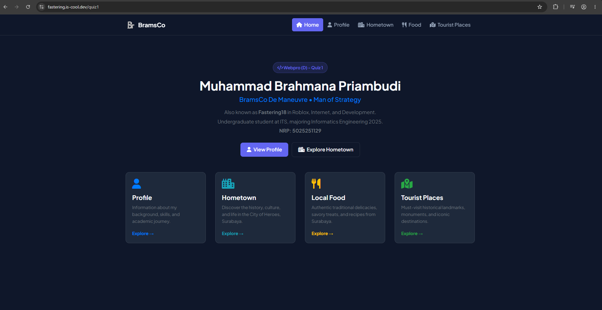
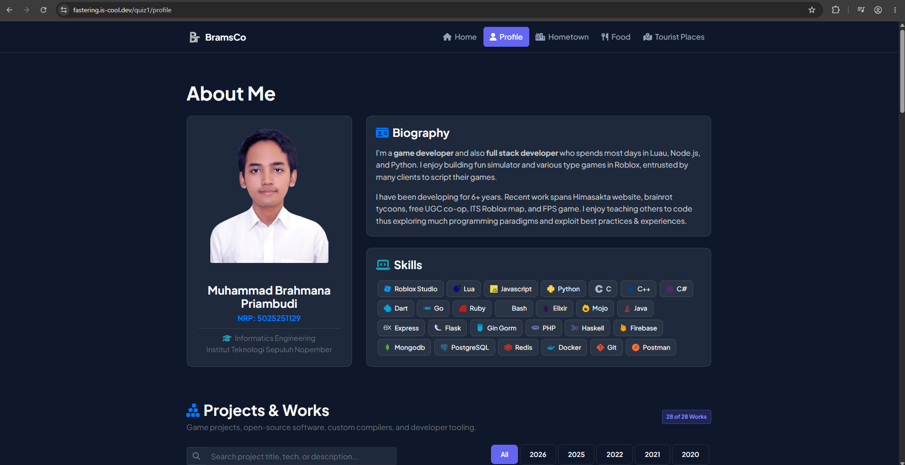
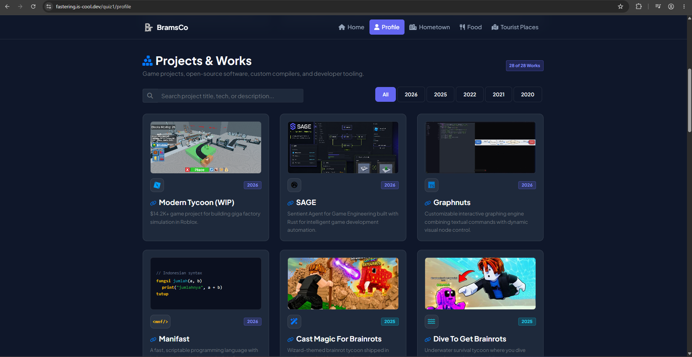
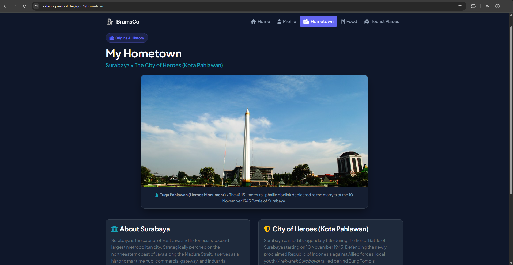
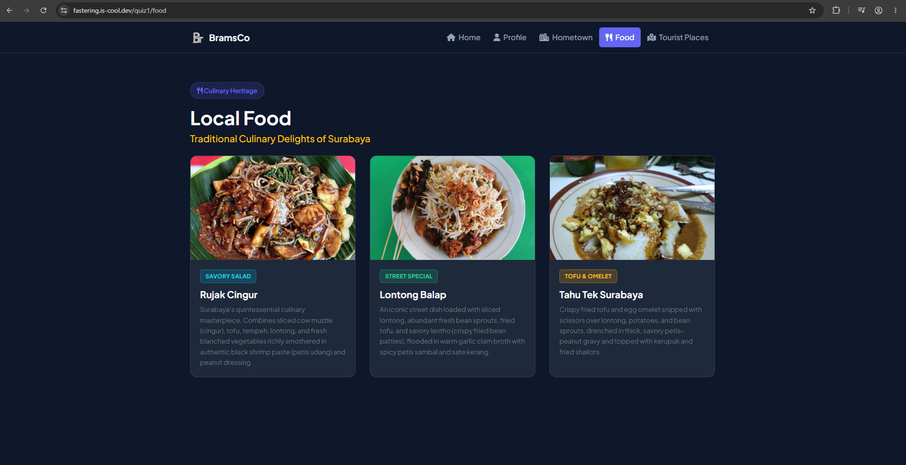
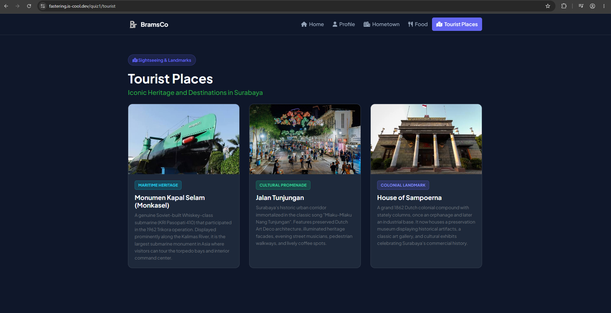

# Web Programming - Quiz 1

| NRP | Name | Class |
| :--- | :--- | :--- |
| 5025251129 | Muhammad Brahmana Priambudi | Webpro (D) |

---

## 1. Project Overview

This project is a static personal website developed for the **EF234301 Web Programming (D)** Quiz 1 assignment at Institut Teknologi Sepuluh Nopember (ITS). 

The website showcases personal background, developer experience, and the cultural richness of Surabaya as my hometown. It is built strictly as a client-side static application using HTML, CSS, JavaScript, and Bootstrap framework.

---

## 2. Page Routing & URL Structure

The project conforms to the routing requirements specified in `task.md`:

| Route / File | Page Name | Description |
| :--- | :--- | :--- |
| `/quiz1` (`src/quiz1/index.html`) | **Homepage** | Main landing page introducing the creator and site navigation. |
| `/quiz1/profile` (`src/quiz1/profile.html`) | **Profile** | Bio, technical skills, and dynamic project catalog with search/filter. |
| `/quiz1/hometown` (`src/quiz1/hometown.html`) | **Hometown** | Surabaya history, "Kota Pahlawan", centered Tugu Pahlawan photo. |
| `/quiz1/food` (`src/quiz1/food.html`) | **Local Food** | Authentic culinary specialties with real photos in a grid layout. |
| `/quiz1/tourist` (`src/quiz1/tourist.html`) | **Tourist Places** | Top heritage destinations in Surabaya with photos in a grid layout. |

Clean routing rules are pre-configured for deployment via `src/vercel.json` (for Vercel) and `src/.htaccess` (for Apache / shared hosting).

### Live Deployment
The website is live and hosted at [fastering.is-cool.dev](https://fastering.is-cool.dev):
- **Homepage**: https://fastering.is-cool.dev/quiz1
- **Profile**: https://fastering.is-cool.dev/quiz1/profile
- **Hometown**: https://fastering.is-cool.dev/quiz1/hometown
- **Local Food**: https://fastering.is-cool.dev/quiz1/food
- **Tourist Places**: https://fastering.is-cool.dev/quiz1/tourist

---

## 3. Web Pages & Screenshots

### A. Homepage (`/quiz1`)

The homepage serves as the central hub. It introduces my identity, student credentials, development aliases, and quick jump cards to all other sections of the website.

*Key Highlights:*
- High-contrast sleek dark theme (`#0f172a` canvas, `#1e293b` cards).
- Interactive navigation cards directing users to Profile, Hometown, Local Food, and Tourist Places.
- Fully responsive navigation bar with a smooth custom animated hamburger toggler on mobile viewports.

---

### B. Profile & Project Catalog (`/quiz1/profile`)

The profile page provides a complete overview of my background, developer skillset, and an interactive portfolio showcase of 28 engineering and game development projects.

*Key Highlights:*
- Equal-height split layout featuring avatar, identity badges, biography, and 25+ tech stack tags.
- Dynamic project catalog loaded via self-contained JavaScript (`projects.js`), ensuring zero CORS friction on `file:///` runs.
- Real-time instant search filtering across project titles, tags, and descriptions.
- Year-based filtering buttons with dynamic active state switching.
- Distinct vibrant badges for each year (2026 Indigo, 2025 Cyan, 2022 Emerald, 2021 Amber, 2020 Rose) instead of generic muted gray.
- Uniform 145px card headers: custom preview snippet for Manifast (placed neatly above the icon and year), real project thumbnails, and a clean "No Preview" placeholder for repositories without images.

---

### C. Hometown (`/quiz1/hometown`)

The hometown page explores Surabaya, the capital of East Java and Indonesia's second-largest metropolitan city.

*Key Highlights:*
- Centered hero photograph of **Tugu Pahlawan (Heroes Monument)** with an informative caption.
- Historical narrative explaining the origin of Surabaya's title as *Kota Pahlawan* (City of Heroes) and the significance of the 10 November 1945 Battle of Surabaya.
- Overview of the cultural identity and egalitarian spirit of *Arek-arek Suroboyo*.

---

### D. Local Food (`/quiz1/food`)

The food page celebrates the culinary identity of Surabaya through a responsive 3-column card grid featuring real photographs of authentic local delicacies.

*Dishes Featured:*
1. **Rujak Cingur**: The quintessential Surabaya salad featuring boiled cow muzzle, fresh blanched vegetables, lontong, tofu, and tempeh tossed in rich black shrimp paste (*petis udang*) and peanut dressing.
2. **Lontong Balap**: Iconic street bowl loaded with lontong, crisp bean sprouts, fried tofu, and savory *lentho* (crispy black-eyed pea patties) served in warm garlic clam broth with sambal petis.
3. **Tahu Tek Surabaya**: Crispy fried tofu and egg omelet cut over lontong, potatoes, and bean sprouts, drenched in a velvety petis-peanut gravy and topped with kerupuk.

---

### E. Tourist Places (`/quiz1/tourist`)

The tourist page highlights Surabaya's most prominent heritage and cultural destinations, presented in a structured responsive card grid.

*Destinations Featured:*
1. **Monumen Kapal Selam (Monkasel)**: A genuine Soviet-built Whiskey-class submarine (KRI Pasopati 410) that participated in the 1962 Trikora operation, now preserved as the largest submarine monument in Asia.
2. **Jalan Tunjungan**: Surabaya's historic urban corridor, famed for its colonial Dutch Art Deco architecture, illuminated heritage facades, evening street musicians, and lively pedestrian culture.
3. **House of Sampoerna**: A grand 1862 Dutch colonial heritage compound with stately columns, housing a preservation museum, historical galleries, and cultural exhibits.

---

## 4. Implementation Details & Architecture

### A. Pure Client-Side Static Execution
To ensure complete portability, the website requires no server-side build steps (e.g. npm build, webpack, or vite). All scripts and styles are self-contained. The project catalog is managed through `src/js/projects.js`, eliminating `fetch()` restrictions that typically break `file:///` viewing in modern browsers.

### B. Clean & Authentic Codebase
All instructional comments and AI-generated template placeholders have been systematically stripped across HTML, CSS, and JS files. The code is readable, concise, and focused on functional clarity.

### C. Design Tokens & Styling
Custom CSS variables are defined in `src/css/main.css` for consistent design token management:
- Canvas background: `--bg-color: #0f172a`
- Card background: `--card-bg: #1e293b`
- Brand accent: `--primary: #6366f1`
- Navbar backdrop: `rgba(15, 23, 42, 0.85)` with blur filter
- Year badge color tokens for distinct year visual separation.

---

## 5. Project Evaluation & Conclusion

### Analysis & Evaluation
- **Strengths**: Fully data driven in client-side (JS), clean and readable pages, responsive design on mobile and PC Desktop, PWA ready.
- **Responsive Experience**: Tested across desktop viewports and mobile screens, ensuring clean collapsing navigation, touch-friendly buttons, and consistent card layouts.
- **Maintainability**: Clear folder hierarchy separating assets, stylesheets, scripts, and quiz pages.

### Conclusion
This project contains all the necessary requirements for Quiz Webpro. All projects, foods, and tourist places are my choices and i have tried them which mark experience to me. I hope can find interest on my lists provided in web. You can also click on any projects (title) of mine which redirect to either github repo or actual game link to play. Thanks and best regards.

### Note on AI Usage  
From the start, i have planned to structure the folders separating by file type. I have experience using bootstrap framework 5+ years ago so i start with navbar, sections, and grids. Sometimes i forgot how to make grids and cards so i asked AI and relearn from it again. *BramsCo De Maneuvre*, *Man of Strategy*, Biography, and skills are my own written content. For hometown, food, and tourist places, i listed my own interesting choice and ask ai to fix my writing/information and add some edit to it. 

---

## 6. Academic Integrity Pledge

“By the name of Allah (God) Almighty, I hereby pledge and declare that I have completed Quiz 1 independently. I have not engaged in cheating, plagiarism, or received unauthorized assistance in any form. I further declare that any use of AI tools was limited to a supportive role (such as for grammar checking or debugging), and that the final solution is the product of my own intellectual effort. I understand that I will accept all consequences if I am found to have violated this academic integrity pledge.”

Surabaya, 25 September 2026

**Muhammad Brahmana Priambudi**  
NRP: 5025251129
